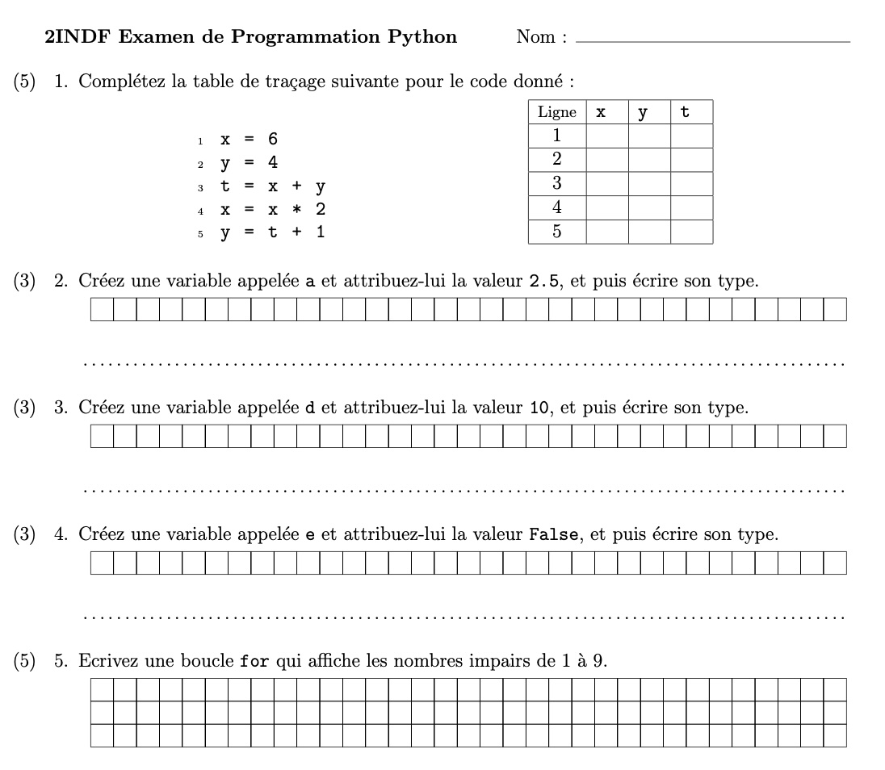

# ConstructeurExamPython-2INDF

*(Mes remerciements à ChatGPT 4.0 mardi 2 juillet, mais les erreurs sont les miennes)*

Ce répertoire contient un script Python qui automatise la génération l'examen de rentrée de programmation en Python pour des étudiants de 2INDF, en utilisant LaTeX pour la mise en forme du document final. Le script génère des questions aléatoire sur les variables et les boucles, adaptées pour tester les compétences essentielles en Python. 

Nous, les enseignants, pouvons donc partager des examens pour toute l'année et dans toutes les classes, même avant les jours d'examen, sans craindre que les élèves aient simplement mémorisé les réponses.

## Fonctionnalités
- Génération de Variables Aléatoires: Crée des variables aléatoires pour chaque examen afin d'assurer une variété dans les questions.
- Questions sur Types de Données: Génère des questions pour créer et manipuler des int, float, str, list, et bool.
- Utilisation de Boucles: Pose des questions aléatoires pour la création d'une boucle for.

## Exemple

## Usage
Pour générer un examen, exécutez le script principal:

``python generate_exam.py``

Cela produira un fichier LaTeX et un fichier PDF avec le nom examen_python.pdf, contenant l'examen généré.

## Dépendances
Ce projet nécessite Python 3.x et les paquets suivants:
- random
- latex

## Contribution
Les contributions pour améliorer le script ou ajouter des fonctionnalités sont les bienvenues. Veuillez soumettre vos pull requests ou ouvrir des issues pour discuter des modifications potentielles.

## Licence
Ce projet est distribué sous la licence MIT. Voir le fichier LICENSE pour plus d'informations.
